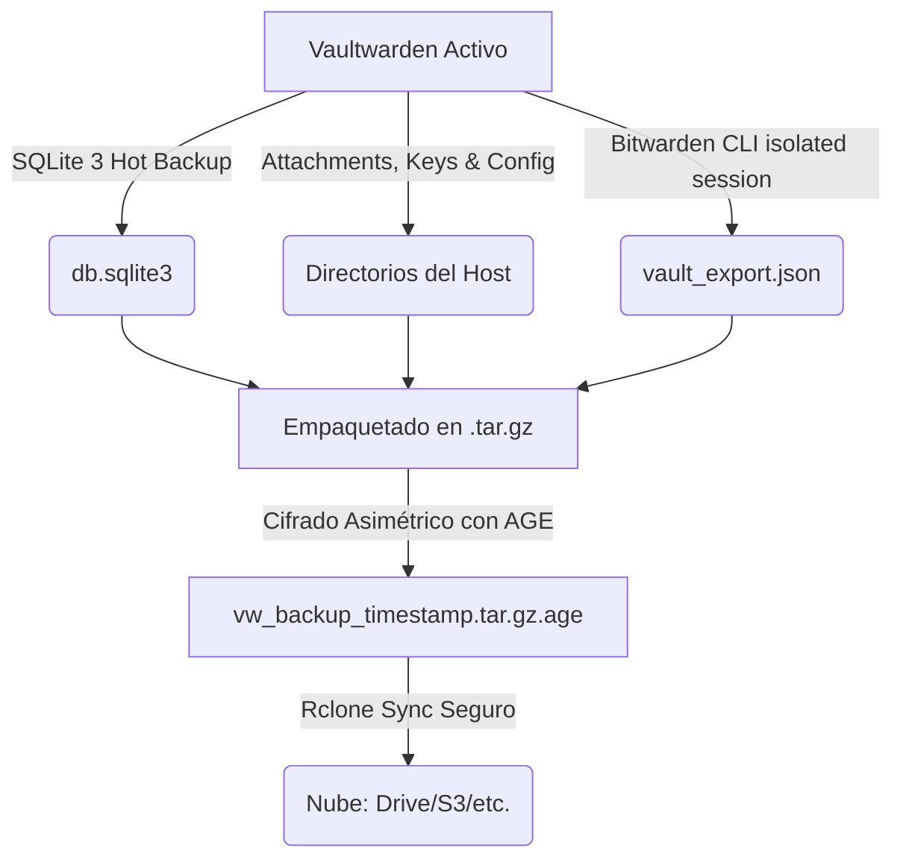

# 🚀 Vaultwarden Self-Hosted: La Guía Definitiva de Operaciones

> **Protege tu soberanía digital** — La solución definitiva de nivel empresarial para auto-hospedar tu gestor de contraseñas con backups automáticos híbridos, cifrado de grado militar (AGE) y despliegue portable sin deuda técnica.

<p align="center">
  
</p>

[](https://www.docker.com/)
[](https://github.com/dani-garcia/vaultwarden)
[](https://age-encryption.org/)
[](LICENSE)

---

## 📑 Tabla de Contenidos
- [✨ Características y Medidas de Seguridad](#-características-y-medidas-de-seguridad)
- [💎 Beneficios Premium Habilitados](#-beneficios-premium-habilitados)
- [🛠️ Requisitos del Sistema](#️-requisitos-del-sistema)
- [🚀 Despliegue Rápido (Replicación en VMs)](#-despliegue-rápido-replicación-en-vms)
- [🌐 Métodos de Despliegue (Acceso Seguro)](#-métodos-de-despliegue-acceso-seguro)
- [🔐 Gestión de Secretos (Zero-Trace AGE)](#-gestión-de-secretos-zero-trace-age)
- [💾 Estrategia de Backup Híbrido](#-estrategia-de-backup-híbrido)
- [🚨 Guía de Recuperación Ante Desastres (Disaster Recovery)](#-guía-de-recuperación-ante-desastres-disaster-recovery)
- [🔄 Actualización de la Plataforma](#-actualización-de-la-plataforma)
- [🛠️ Diagnóstico y Mantenimiento (Troubleshooting)](#️-diagnóstico-y-mantenimiento-troubleshooting)
- [📜 Referencia Completa de Scripts](#-referencia-completa-de-scripts)

---

## ✨ Características y Medidas de Seguridad

| Funcionalidad | Descripción | Beneficio Técnico |
| :--- | :--- | :--- |
| 🐳 **Docker Native** | Despliegue orquestado y encapsulado con Docker Compose. | Aislamiento total de dependencias. |
| 🛡️ **Seguridad No-Root** | Contenedor mapeado dinámicamente al UID/GID del host (`user: "${UID}:${GID}"`). | Cero privilegios `root` en volumen `./data`; elimina vulnerabilidades de escape. |
| 🔐 **Cifrado AGE** | Secretos de entorno (`.env.age`) y backups protegidos con criptografía asimétrica moderna. | Mayor seguridad que GPG, inmune a fuerza bruta estándar. |
| ☁️ **Sincronización Cloud** | Integración nativa con **rclone** para subida cifrada a la nube de tu elección (Drive, S3, etc.). | Tolerancia a desastres físicos y pérdidas de disco duro. |
| ⏰ **Zero-Touch Ops** | Programación segura mediante `cron` con protección contra inyecciones e interpretaciones de escape. | Automatización silenciosa y confiable de mantenimiento y respaldos. |
| 📦 **100% Portable** | Entorno provisionado bajo demanda por **Mise** a nivel de usuario (`~/.local/share/mise`). | Cero uso de `apt`/`dnf`, sin requerir privilegios de `sudo`. |

### 🔒 Medidas de Aislamiento y Control de Accesos
*   **Registros Cerrados por Defecto**: La variable `SIGNUPS_ALLOWED` está definida por defecto como `false` en la plantilla de ejecución. Esto impide registros accidentales o maliciosos si tu URL pública llega a ser indexada.
*   **Apertura Temporal de Invitaciones**:
    *   **Paso 1**: Para invitar a un usuario, arranca el servicio habilitando los registros de forma volátil:
        ```bash
        SIGNUPS_ALLOWED=true ./scripts/start.sh
        ```
    *   **Paso 2**: Una vez que el usuario se haya registrado en la bóveda, simplemente reinicia el servicio con:
        ```bash
        ./scripts/start.sh
        ```
        *Al no pasar la variable explícitamente, la base de datos de configuraciones cargará el valor por defecto (`false`), bloqueando nuevos registros inmediatamente.*

---

## 💎 Beneficios Premium Habilitados

Al utilizar Vaultwarden, se desbloquean automáticamente todas las funcionalidades profesionales y corporativas del ecosistema Bitwarden sin licenciamientos adicionales:

1. 🔑 **TOTP Interno**: Generación nativa de códigos de autenticación de dos factores en cada credencial de tu bóveda.
2. 🛡️ **Seguridad de Hardware**: Soporte nativo para llaves YubiKey, FIDO2, WebAuthn y autenticación biométrica.
3. 🏢 **Organizaciones Ilimitadas**: Creación de colecciones para compartir contraseñas, credenciales wifi y notas de forma segura entre miembros del equipo o familiares.
4. 📊 **Reportes de Auditoría de Seguridad**: Análisis automático en busca de contraseñas expuestas en filtraciones masivas (*Have I Been Pwned*), credenciales reutilizadas o débiles.
5. 📎 **Adjuntos Cifrados en Bóveda**: Almacenamiento seguro de llaves de recuperación, imágenes y PDFs asociados a tus accesos.

---

## 🛠️ Requisitos del Sistema

La meta principal del proyecto es la portabilidad extrema. Solo necesitas una dependencia global instalada en el sistema anfitrión:

### Docker y Docker Compose
Puedes aprovisionar Docker en cualquier distribución Linux moderna (Ubuntu, Debian, Fedora, Arch, Alpine, etc.) con el comando estándar:
```bash
curl -fsSL https://get.docker.com -o get-docker.sh
sudo sh get-docker.sh
```
> **¿Y el resto de herramientas? (`age`, `rclone`, `sqlite3`, `node`, `bw`...)**
>
> **No requieres instalar nada.** Nuestro script inicializador `install.sh` descarga automáticamente el motor de entornos [Mise-en-place](https://mise.jdx.dev) y aprovisiona todas las herramientas en espacio de usuario (`~/.local/share/mise`). Tu sistema operativo se mantiene 100% limpio y libre de librerías en conflicto.

---

## 🚀 Despliegue Rápido (Replicación en VMs)

Este repositorio está optimizado para contar con **0 Deuda Técnica**, lo que te permite replicar la infraestructura idéntica en cualquier nueva máquina virtual en cuestión de segundos:

### Paso 1: Clonar el Repositorio en la Nueva VM
La ruta recomendada en entornos de producción es `/opt/vaultwarden`:
```bash
sudo git clone https://github.com/TU_USUARIO/vaultwarden-proxmox.git /opt/vaultwarden
sudo chown -R $USER:$USER /opt/vaultwarden
cd /opt/vaultwarden
```

### Paso 2: Ejecutar el Aprovisionador Portable
El instalador modular verificará Docker, descargará Mise e instalará la versión probada de todas las herramientas locales:
```bash
chmod +x scripts/*.sh
./scripts/install.sh
```

### Paso 3: Configurar tus Credenciales
1. Edita el archivo `.env` creado por el instalador:
   ```bash
   nano .env
   ```
2. Rellena las credenciales básicas (`BW_PASSWORD`, `DOMAIN`, `RCLONE_REMOTE`).
3. Cifra el entorno para activar el flujo seguro de producción:
   ```bash
   ./scripts/manage_secrets.sh encrypt
   ```

---

## 🌐 Métodos de Despliegue (Acceso Seguro)

### 🔷 Opción A: Cloudflare Zero Trust (Dominio Público Seguro)
Este es el método de producción recomendado por excelencia, ya que **no expone puertos abiertos al internet público** de tu hogar u oficina:

1. Deja el puerto de tu Vaultwarden configurado por defecto en la máquina local (`127.0.0.1:8080`).
2. En tu panel de Cloudflare Zero Trust, crea un **Tunnel (App)** y asócialo a un subdominio (ej: `vault.mi-dominio.com`).
3. Apunta el tráfico del túnel a la dirección de origen interna: `http://localhost:8080`.
4. Define en el `.env`: `BW_HOST=https://vault.mi-dominio.com` y `DOMAIN=https://vault.mi-dominio.com`.
5. Levanta el stack:
   ```bash
   ./scripts/start.sh
   ```

### 🟣 Opción B: Tailscale (Red Privada VPN)
Ideal si deseas que tu gestor de contraseñas sea visible únicamente cuando tu dispositivo esté conectado a tu VPN de Tailscale:

1. Levanta el servicio de Vaultwarden por primera vez:
   ```bash
   ./scripts/start.sh
   ```
2. Indica a Tailscale que publique el puerto mediante HTTPS (generará certificados SSL oficiales de forma automática):
   ```bash
   sudo tailscale serve --bg --https=443 localhost:8080
   sudo tailscale status # Copia la URL generada (https://xyz.ts.net)
   ```
3. Edita tus secretos con `./scripts/manage_secrets.sh edit` y actualiza la URL `BW_HOST` y `DOMAIN` con la URL HTTPS de tu nodo en Tailscale.

### 🟢 Opción C: Proxy Inverso Tradicional (Caddy / Nginx)
Si prefieres exponer el puerto públicamente de manera tradicional utilizando un certificado SSL propio gestionado en tu servidor:

*   **Configuración con Caddy (Recomendado por simplicidad)**:
    ```caddy
    vault.tu-dominio.com {
        reverse_proxy localhost:8080
    }
    ```
*   **Configuración con Nginx**:
    ```nginx
    server {
        listen 80;
        server_name vault.tu-dominio.com;
        return 301 https://$host$request_uri;
    }

    server {
        listen 443 ssl;
        server_name vault.tu-dominio.com;

        ssl_certificate /etc/letsencrypt/live/vault.tu-dominio.com/fullchain.pem;
        ssl_certificate_key /etc/letsencrypt/live/vault.tu-dominio.com/privkey.pem;

        location / {
            proxy_pass http://127.0.0.1:8080;
            proxy_set_header Host $host;
            proxy_set_header X-Real-IP $remote_addr;
            proxy_set_header X-Forwarded-For $proxy_add_x_forwarded_for;
            proxy_set_header X-Forwarded-Proto $scheme;
        }

        # Soporte para WebSockets (Notificaciones Push en vivo)
        location /notifications/hub {
            proxy_pass http://127.0.0.1:8080;
            proxy_set_header Upgrade $http_upgrade;
            proxy_set_header Connection "upgrade";
            proxy_set_header Host $host;
        }
    }
    ```

---

## 🔐 Gestión de Secretos (Zero-Trace AGE)

El stack no almacena contraseñas en texto plano en disco duro. Toda la configuración del motor y accesos externos reside de forma encriptada en `.env.age` usando tu **Master Identity Key** de AGE.

### Flujo Seguro de Ejecución (Zero-Trace)
Cuando ejecutas `./scripts/start.sh`:
1. El script descifra `.env.age` temporalmente a `.env` en memoria/disco.
2. Inicia los servicios con `docker compose up -d` y exporta los valores.
3. Al finalizar, un interceptor `trap EXIT` elimina instantáneamente el archivo `.env` plano.
4. **Resultado**: Los secretos solo existen en texto plano durante la milésima de segundo que tarda en levantarse el contenedor de Docker.

### Comandos de Administración de Secretos
```bash
# Inicializar tus llaves maestras por primera vez
./scripts/manage_secrets.sh setup

# Mostrar tu Clave Privada de AGE (RESPALDO CRÍTICO)
./scripts/manage_secrets.sh show-key

# Modificar tus variables de entorno (.env.age) de forma atómica y segura
./scripts/manage_secrets.sh edit
```
> [!CAUTION]
> **Respalda tu Clave Privada de AGE**: La clave mostrada por `show-key` es la única llave criptográfica capaz de descifrar tus configuraciones y tus backups automáticos. Guárdala en una libreta física o en tu gestor de contraseñas de nube. Sin ella, tus backups son simplemente bits ilegibles de basura digital.

---

## 💾 Estrategia de Backup Híbrido

Implementamos una estrategia redundante para darte **Cero Deuda Técnica** ante cualquier catástrofe de infraestructura:



### Elementos Incluidos en el Respaldo Híbrido
Cada ciclo del programador genera un archivo único y blindado con extensión `.tar.gz.age` que alberga:

1. 📀 **System Backup (Copia Fiel del Servidor)**:
   * **Base de datos sqlite3**: Generada en caliente mediante el comando `.backup` de SQLite de Mise para garantizar 100% de consistencia de transacciones (WAL mode).
   * **Adjuntos (`attachments/`)**: Todos los archivos y llaves de seguridad físicas.
   * **Configuraciones criptográficas (`rsa_key*`, `config.json`)**: Mantiene la firma digital única del servidor para evitar desautenticación en dispositivos móviles y navegadores.

2. 📄 **JSON Export (Portabilidad de Emergencia)**:
   * **`vault_export.json`**: Un volcado plano, estructurado y compatible con Bitwarden. 
   * **Ventaja**: Si decides no volver a configurar un servidor propio nunca más, puedes descifrar manualmente el archivo `.tar.gz.age` con tu llave AGE, extraer el JSON plano e importarlo directamente en los servidores de Bitwarden Cloud oficiales.

---

## 🚨 Guía de Recuperación Ante Desastres (Disaster Recovery)

Si tu servidor de producción físico o VM quedó completamente inoperable y requieres levantar el sistema en una máquina totalmente nueva, este es el flujo sistemático para lograrlo con cero deuda técnica:

### 1. Preparar la Identidad en la Nueva VM
Antes de lanzar cualquier servicio, debes decirle al sistema quién eres restaurando tu llave AGE:
```bash
mkdir -p ~/.age
nano ~/.age/vaultwarden.key  # Pega aquí el texto completo de tu clave privada de respaldo
chmod 600 ~/.age/vaultwarden.key
```

### 2. Clonar e Instalar
Sigue los pasos rápidos de aprovisionamiento:
```bash
git clone https://github.com/TU_USUARIO/vaultwarden-proxmox.git /opt/vaultwarden
cd /opt/vaultwarden
./scripts/install.sh --deps
```

### 3. Re-configurar Secretos de Arranque
Dado que `.env.age` no es portado en los backups por medidas de seguridad, restáuralo o créalo en la nueva máquina:
```bash
./scripts/manage_secrets.sh edit
# Completa tus variables de entorno correspondientes a esta nueva VM
```

### 4. Obtener y Descargar el Backup de la Nube
Trae el backup cifrado desde tu nube y guárdalo en la raíz de `/opt/vaultwarden`:

* **Método Automático con Rclone** (Recomendado):
  ```bash
  # Configurar rclone si no se ha hecho
  rclone config
  
  # Listar archivos disponibles en tu bucket/carpeta
  rclone lsl gdrive:Vaultwarden
  
  # Descargar el archivo deseado
  rclone copy gdrive:Vaultwarden/vw_backup_YYYYMMDD_HHMMSS.tar.gz.age .
  ```
* **Método de Subida Manual**:
  Puedes arrastrar tu archivo `.tar.gz.age` usando FileZilla/SFTP a `/opt/vaultwarden/`.

### 5. Lanzar los Servicios (Primer Arranque de Estructura)
Es indispensable iniciar el servicio docker compose una vez para que cree los volúmenes del sistema y las redes locales de mapeo:
```bash
./scripts/start.sh
```

### 6. Ejecutar la Restauración Atómica
Ejecuta el asistente pasándole el backup como argumento. El script detendrá de forma segura el contenedor, respaldará el estado actual vacío como medida preventiva, extraerá la base de datos y adjuntos consistentes y encenderá de nuevo el motor:
```bash
./scripts/restore.sh vw_backup_YYYYMMDD_HHMMSS.tar.gz.age
```
> [!NOTE]
> **Permisos Host Asegurados**: Gracias a la directiva `user: "${UID}:${GID}"` que implementamos en nuestro Docker, todos los archivos restaurados mantendrán la propiedad de tu usuario local y no requerirán el uso de comandos invasivos `chown` o permisos `sudo`.

### 📂 Extracción Manual y Desencriptación sin Servidor
Si estás en una laptop externa (Windows, macOS o Linux) y necesitas recuperar urgentemente tu base de datos o tus contraseñas en formato JSON **sin tener Docker ni levantar un servidor completo**, puedes hacerlo de forma puramente matemática con la herramienta `age` instalada en tu equipo local:

1.  Copia tu llave privada (`vaultwarden.key`) y tu archivo cifrado de respaldo (`vw_backup_xxxx.tar.gz.age`) a un mismo directorio.
2.  **Desencriptar el archivo comprimido**:
    ```bash
    age -d -i vaultwarden.key -o backup.tar.gz vw_backup_xxxx.tar.gz.age
    ```
3.  **Descomprimir el contenido**:
    ```bash
    tar -xzf backup.tar.gz
    ```
4.  **Resultado**: Obtendrás una carpeta con los siguientes archivos planos:
    *   `db.sqlite3`: La base de datos cruda de contraseñas.
    *   `vault_export.json`: El archivo portátil listo para ser importado en **Bitwarden Cloud** en 10 segundos.
    *   `attachments/`: Carpeta con todos tus documentos y archivos multimedia adjuntos.

---

## 🔄 Actualización de la Plataforma

Para mantener tu servidor seguro y libre de exploits conocidos, te recomendamos programar o ejecutar manualmente actualizaciones de la imagen de Vaultwarden:

* **Actualización en Caliente**:
  ```bash
  ./scripts/update.sh
  ```
  Este comando descargará de forma segura la última versión de producción distribuida de `vaultwarden/server`, detendrá el contenedor un instante, recargará el motor y lo levantará sin alterar tus base de datos locales ni configuraciones.
  
* **Programación Automática (Recomendada)**:
  Puedes automatizar las actualizaciones del contenedor para que ocurran cada domingo a las 4:00 AM ejecutando:
  ```bash
  ./scripts/install.sh --cron-update
  ```

---

## 🛠️ Diagnóstico y Mantenimiento (Troubleshooting)

Si algo no funciona como debería, sigue estos comandos clave para inspeccionar el estado del sistema con total visibilidad:

### 1. Inspeccionar Logs del Servidor en Tiempo Real
Permite ver intentos de inicio de sesión, problemas de conexión a la base de datos o errores en peticiones HTTP:
```bash
docker compose logs -f vaultwarden
```

### 2. Verificar Estado de los Contenedores
Muestra si el contenedor está activo, se encuentra en reinicio continuo (`restarting`) o se detuvo con errores:
```bash
docker compose ps
```

### 3. Verificar Logs de las Tareas en Cron (Backups)
Si sospechas que un cron no se ejecutó, revisa el archivo de registro generado localmente:
```bash
# Ver las últimas 50 ejecuciones del backup híbrido
tail -n 50 backup.log

# O si se ejecuta como servicio global en el sistema:
tail -n 50 /var/log/vaultwarden_backup.log
```

### 4. Probar Conexión Cloud (Rclone) de Forma Segura
Valida si tus credenciales de Google Drive, AWS S3 o Dropbox configuradas en Rclone siguen siendo válidas:
```bash
# Listar los directorios principales en la carpeta de destino
rclone lsd "${RCLONE_REMOTE:-gdrive:Vaultwarden}"
```

### 5. ¿Bóveda sqlite3 Bloqueada o Lenta?
Vaultwarden maneja la base de datos en modo `WAL` de forma óptima. Si en algún momento necesitas liberar espacio o reconstruir índices para optimizar la velocidad:
```bash
# Entrar al directorio del proyecto y ejecutar la optimización segura
sqlite3 ./data/db.sqlite3 "VACUUM;"
```

---

## 📜 Referencia Completa de Scripts

| Script | Propósito | Comportamiento Técnico |
| :--- | :--- | :--- |
| `install.sh` | Instalador y Configurador de Cron | Instala entorno portable Mise, valida Docker y gestiona el Crontab de usuario mediante `printf` seguro. |
| `manage_secrets.sh` | Administración de Criptografía AGE | Gestiona la creación de llaves, cifrado/descifrado y edición atómica basada en sumas de verificación SHA256. |
| `start.sh` | Iniciador Seguro (Zero-Trace) | Carga los secretos en un `.env` temporal, levanta compose con UID/GID del host y elimina el archivo plano al salir. |
| `update.sh` | Actualizador del Motor | Realiza `pull` de la última versión de la imagen y recrea los contenedores docker con mapeo UID/GID seguro. |
| `backup.sh` | Generador de Backup Híbrido | Realiza un `Hot Backup` de SQLite, exporta JSON mediante sesión aislada de `Bitwarden CLI`, comprime, cifra con AGE y sube con Rclone. |
| `restore.sh` | Gestor de Desastres | Detiene el contenedor, realiza respaldo precautorio local, extrae los archivos consistentes y reactiva el stack de forma atómica. |

---

<p align="center">Diseñado y Mantenido con rigor técnico y ❤️ por <a href="https://github.com/herwingx">herwingx</a></p>
